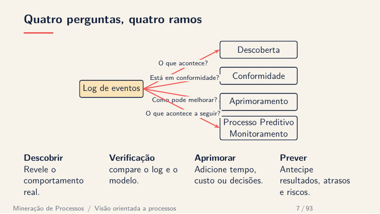
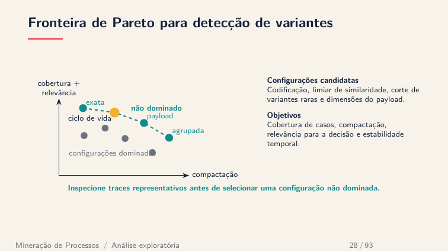
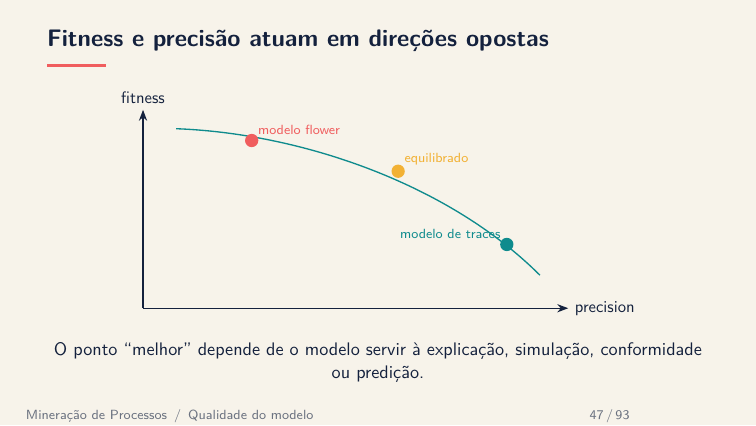
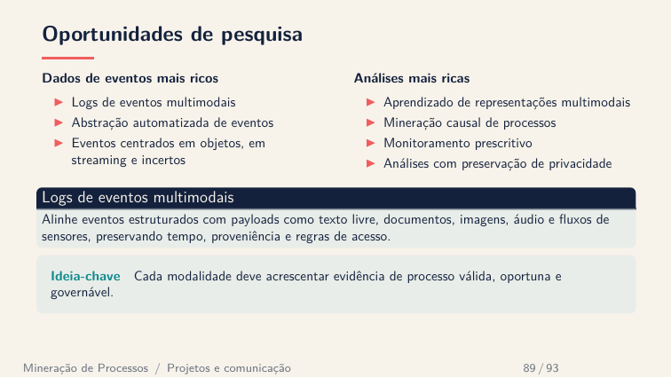

# Mineração de Processos: dos Eventos às Decisões

**Curso intensivo de 6 horas, com slides e práticas
reproduzíveis em Python.**

Este curso apresenta Process Mining como uma ponte entre dados, processos e
decisões. Em vez de começar por algoritmos isolados, partimos de perguntas:
**o que realmente acontece, o que não está em conformidade, como melhorar e o
que provavelmente acontecerá a seguir?**

> A ideia central é aprender a construir evidência confiável a partir de
> eventos, sem esconder as escolhas de representação, os compromissos entre
> métricas ou as limitações dos modelos.

**Professor:** [Sylvio Barbon Junior](https://barbon.inginf.units.it/)  
**Áreas conectadas:** Process Mining, Machine Learning, Data Science e
Inteligência Artificial.

## Para quem é o curso

O material foi pensado para estudantes, pesquisadores e profissionais que
desejam compreender processos reais a partir de dados. Conhecimentos básicos
de análise de dados e Python ajudam nas práticas, mas não são necessários para
acompanhar a parte conceitual.

Ao final das seis horas, o participante deverá ser capaz de:

- reconhecer casos, atividades, timestamps, recursos e payloads em um log;
- avaliar a qualidade semântica dos dados antes de aplicar algoritmos;
- analisar variantes e usar Pareto para equilibrar cobertura e compactação;
- descobrir modelos e discutir fitness, precisão, generalização e simplicidade;
- relacionar conformidade, desempenho, organização e previsão;
- reconhecer quando abordagens centradas em objetos ou multimodais são mais adequadas.

## Ementa

| Módulo | Tópicos |
| --- | --- |
| 1. Visão orientada a processos | Eventos, traces, ciclo de vida, perspectiva de controle de fluxo e perguntas analíticas |
| 2. Engenharia e exploração | Semântica do log, profiling, flattening, variantes, payloads e fronteira de Pareto |
| 3. Modelagem e descoberta | DFG, Petri nets, BPMN, descoberta indutiva e estratégias de modelagem |
| 4. Qualidade e conformidade | Fitness, precisão, generalização, simplicidade, token replay e alinhamentos |
| 5. Aprimoramento e ML | Desempenho, gargalos, recursos, handovers, encoding e monitoramento preditivo |
| 6. Novas perspectivas | Processos centrados em objetos, OCEL, logs multimodais, comunicação e oportunidades de pesquisa |

## Roteiro de 6 horas

| Horário | Atividade |
| --- | --- |
| 00:00–00:45 | Módulo 1: adotar uma visão orientada a processos antes de pensar em algoritmos |
| 00:45–01:30 | Módulo 2: construir e explorar um log confiável |
| 01:30–01:45 | Pausa |
| 01:45–02:30 | Módulo 3: representar e descobrir comportamento |
| 02:30–03:15 | Módulo 4: avaliar modelos e desvios |
| 03:15–03:30 | Pausa |
| 03:30–04:15 | Módulo 5: explicar desempenho e antecipar resultados |
| 04:15–05:00 | Módulo 6: objetos, multimodalidade e pesquisa |
| 05:00–05:45 | Prática integradora com variantes, modelos e métricas |
| 05:45–06:00 | Síntese, limitações e próximos passos |

## Uma amostra da jornada

### Das perguntas aos métodos

Process Mining não é um único algoritmo. Cada ramo responde a uma pergunta
diferente e exige evidências e critérios de validação próprios.



### Variantes são uma decisão multicritério

Cobertura, compactação, relevância e estabilidade podem entrar em conflito. A
fronteira de Pareto ajuda a comparar configurações não dominadas, mas não
substitui a inspeção dos traces nem a decisão de domínio.



### Não existe uma única métrica de qualidade

Um modelo pode reproduzir o log e ainda permitir comportamento demais. Fitness
e precisão ilustram por que a escolha do “melhor” modelo depende do uso
pretendido.



### O evento pode carregar muito mais que uma atividade

Textos, documentos, imagens, áudio e sensores podem enriquecer a análise, desde
que tempo, proveniência, acesso e validade semântica sejam preservados.



## Materiais

- [Slides completos em português](slides/pt/slides.pdf)
- [Slides completos em inglês](slides/en/slides.pdf)
- [Seis módulos independentes](slides/README.md)
- [Oito laboratórios em notebooks](labs/README.md)
- [Roteiro de ensino em português](teaching/pt/README.md)

Para compilar os decks Beamer:

```bash
make all
```

Para instalar as dependências e validar todas as práticas:

```bash
python3 -m pip install -r labs/requirements.txt
make lab-check
```

## Referências essenciais

1. van der Aalst, W. M. P.; Carmona, J. (eds.). [*Process Mining Handbook*](https://doi.org/10.1007/978-3-031-08848-3). Springer, 2022.
2. van der Aalst, W. M. P. *Process Mining: Data Science in Action*. 2. ed. Springer, 2016.
3. Carmona, J.; van Dongen, B.; Solti, A.; Weidlich, M. *Conformance Checking: Relating Processes and Models*. Springer, 2018.
4. [PM4Py: documentação e exemplos](https://processintelligence.solutions/static/api/2.7.17/index.html).
5. [IEEE Task Force on Process Mining](https://www.tf-pm.org/resources).
6. [OCEL 2.0: especificação e logs](https://www.ocel-standard.org/).

## Pesquisa do professor relacionada ao curso

Esta seleção, extraída do
[currículo de Sylvio Barbon Junior](https://sbarbonjr.github.io/#publications),
mostra como os temas do curso se conectam a problemas de pesquisa atuais:

- Malina, G. I.; Azin, M.; Rosso, A. F.; Alan, D. P.; Dario, C.; Barbon Junior, S. [*A Design-Oriented Process Mining Framework for Railway Operations*](https://scholar.google.it/citations?view_op=view_citation&hl=pt-BR&user=79-H1NkAAAAJ&sortby=pubdate&citation_for_view=79-H1NkAAAAJ:dhpJJ7xvgBgC). Information, 17(5), 483, 2026.
- Moradbeikie, A.; Grigore, I. M.; Lopes, S. I.; Barbon Junior, S. [*Sensor2EventLog: Bridging Continuous IoT Data and Process Mining through Eventization*](https://scholar.google.it/citations?view_op=view_citation&hl=pt-BR&user=79-H1NkAAAAJ&sortby=pubdate&citation_for_view=79-H1NkAAAAJ:dMpQl7XwOw4C). International Conference on Advanced Information Systems Engineering (CAiSE), 177–194, 2026.
- Moradbeikie, A. et al. *Process Mining of Sensor Data for Predictive Process Monitoring: A HACCP-Guided Pasteurization Study Case*. Systems, 13(11), 935, 2025.
- Grigore, I. M. et al. *Towards Trace Variant Explainability*. ADBIS, 2025.
- Ceravolo, P. et al. *Tuning ML to Address Process Mining Requirements*. IEEE Access, 12, 24583–24595, 2024.
- Oyamada, R. S. et al. *Enhancing Predictive Process Monitoring with Time Features*. CAiSE, 71–86, 2024.
- Tavares, G. M. et al. *Trace Encoding in Process Mining: Survey*. Engineering Applications of Artificial Intelligence, 126, 107028, 2023.
- Tavares, G. M. et al. *Automating Process Discovery with Meta-Learning*. CoopIS, 205–222, 2022.
- Barbon Junior, S. et al. [*Using Meta-Learning to Recommend Process Discovery Methods*](https://arxiv.org/abs/2103.12874). arXiv:2103.12874, 2021.
- Junior, S. B. et al. *Evaluating Trace Encoding Methods in Process Mining*. DataMod, 174, 2020.

---

O repositório foi organizado para permitir tanto uma aula panorâmica de seis
horas quanto o aprofundamento posterior em módulos e laboratórios independentes.
